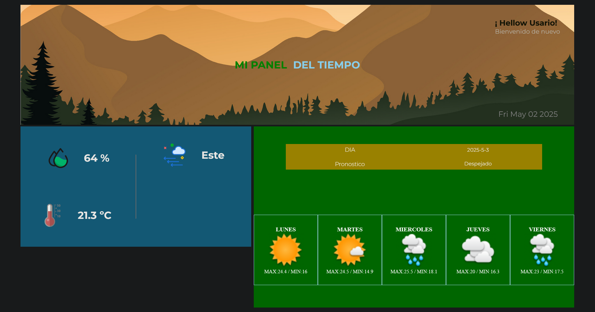

📌 Descripción General

Se desarrolló una aplicación web tipo dashboard de clima utilizando la biblioteca React. La aplicación permite consultar las condiciones climáticas actuales de la ciudad de Buenos Aires, obteniendo los datos desde la API externa de tutiempo.net.

    ⚠️ Debido a las limitaciones de esta API, la consulta está restringida exclusivamente a Buenos Aires, ya que no permite búsquedas dinámicas por nombre de ciudad.
    Para habilitar una búsqueda personalizada por ciudad, sería necesario integrar una API adicional que permita convertir nombres de ciudades en coordenadas geográficas (por ejemplo, OpenWeatherMap o WeatherAPI).

🧠 Tecnologías utilizadas

React con Vite como entorno de desarrollo

JavaScript (ES6+)

CSS para estilos

Axios para llamadas HTTP

API de Tutiempo.net para datos climáticos

⚙️ Funcionalidades Principales

Buscar clima por ciudad.

Mostrar datos actuales: temperatura, humedad, viento, sensación térmica, etc.

Ver pronóstico por días.

